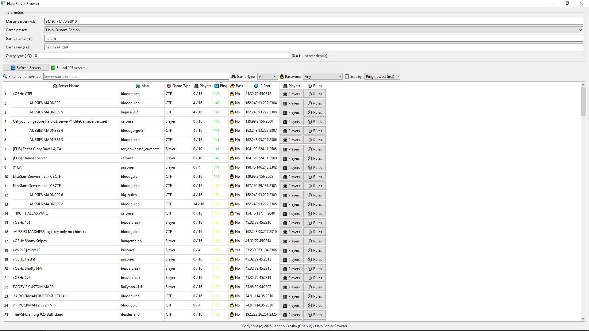
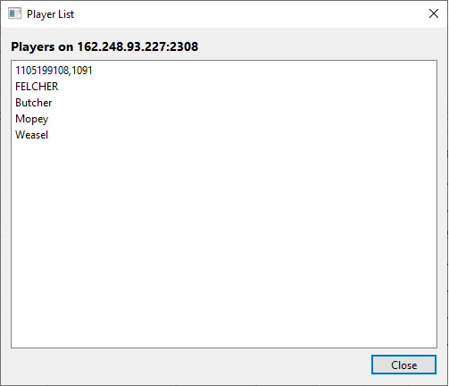
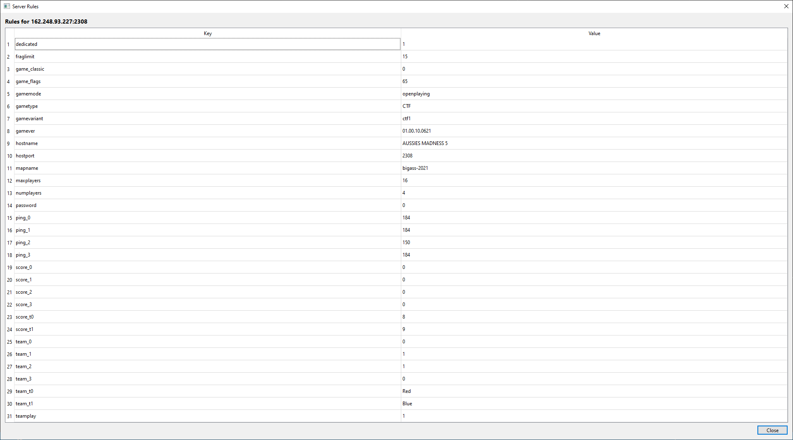

# HaloServerBrowser

A native Windows desktop server browser for Halo: Custom Edition (and other Halo titles), using `gslist.exe` to query master servers. Built with Qt 6 and CMake.

[](https://github.com/Chalwk/HaloServerBrowser/releases/latest)
[](https://github.com/Chalwk/HaloServerBrowser/blob/main/LICENSE)


---

<table>
  <tr>
    <td></td>
    <td></td>
    <td></td>
  </tr>
</table>

---

## Features

- Fetch live server list from Halo: Beta, Halo: Demo, Halo: Custom Edition, and more.
- Filter by server name, map, game type, password protection.
- Sort by ping, player count, name, or map.
- View current players on any server (full details query).
- Display server settings.
- **Caching** of server details to reduce repeated queries.
- Native Windows installer via NSIS.

---

## Getting Started

You have two options to get the application:

1. **Download the installer (recommended)**  
   Grab the latest `HaloServerBrowserSetup.exe` from the [Releases page](https://github.com/Chalwk/HaloServerBrowser/releases).  
   The installer will:
     - Install the application to `C:\Program Files\HaloServerBrowser`.
     - Create a Desktop shortcut and a Start Menu folder with both application and uninstall shortcuts.
     - Register the application in Windows **Add/Remove Programs** for easy uninstallation.

2. **Build from source**  
   If you prefer to compile the application yourself, follow instructions below.

---

## Requirements

- Windows 10 or 11
- Visual Studio Build Tools 2022 or 2026 with Desktop Development with C++ workload
- CMake 3.24 or newer
- Qt 6.x (MSVC 2022 64-bit build)
- `gslist.exe` (download from [Luigi Auriemma's site](https://aluigi.altervista.org/papers.htm#gslist)) placed in the project root.

---

## Install Qt

1. Download and run the Qt Online Installer.
2. Select Qt 6.x for Desktop Development, ensuring the **MSVC 2022 64-bit** kit is included.
3. After installation, confirm the path exists: `C:\Qt\<version>\msvc2022_64\lib\cmake\Qt6`

---

## Build & Package

### Automated (recommended)
Run `build.bat`. It will clean, configure, build, package dependencies, and generate the NSIS installer.

### Manual steps
```bash
rmdir /s /q build
cmake -S . -B build -DQt6_DIR="C:/Qt/6.11.1/msvc2022_64/lib/cmake/Qt6"
cmake --build build --config Release
package.bat build
cd installer
makensis HaloServerBrowser.nsi
```

> Adjust the Qt path in `build.bat` and `package.bat` if needed.
> `HaloServerBrowserSetup.exe` will appear in `root`.

---

## Credits

- **Luigi Auriemma** - author of `gslist`
- **Jericho Crosby (Chalwk)** - Qt wrapper and GUI

### Third-Party Credits

This project includes the following third-party software:

- **[gslist](https://aluigi.altervista.org/papers.htm#gslist)** by Luigi Auriemma  
  A command-line tool for querying game server lists. It is used under the GPL license.

---

## License

This project is licensed under the **GNU General Public License Version 3, 29 June 2007**.  
Copyright (c) 2026 Jericho Crosby (Chalwk). See the [LICENSE](LICENSE) file for details.

---